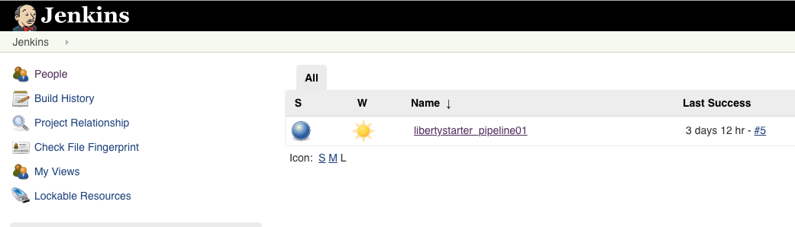
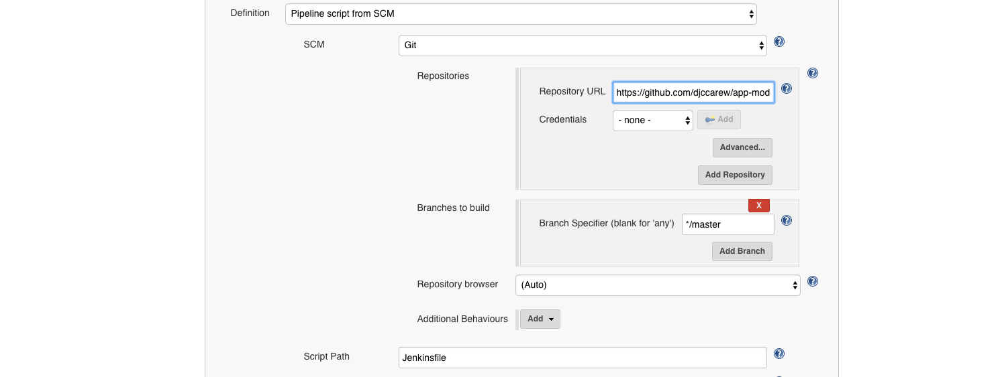
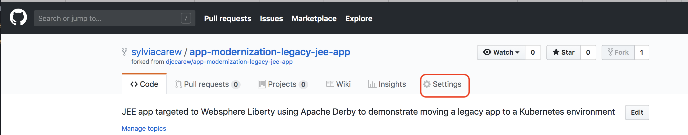

# IBM Client Developer Advocacy App Modernization Series

## Lab - Migrating Legacy JEE apps to IBM Cloud Private

### Part 3 -  Creating a CI/CD Pipeline for deployment to IBM Cloud Private using Jenkins

## Overview

In this lab you will  be connecting a Git repository to a Continuous Integration/Continuous Deployment pipeline built with Jenkins on IBM Cloud Private.

## Setup

If you haven't already:

1. Complete *Part 2 -  Working with Helm*  by following the instructions [here](https://github.com/djccarew/app-modernization-helm-lab)

2. Login to the VM designated as the client env to ICP using the credentials  provided  to you

3. From a  client  terminal window log in to the ICP Cluster with the following command:
```
    cloudctl login -a https://[ICP Master IP]:8443 --skip-ssl-validation
```
4. Go to the folder where you cloned the Plants By WebSphere  app in the previous lab
```
   cd app-modernization-plants-by-websphere-jee6
```   

###  Step 1: Set up the CI/CD pipeline

In this section we will be connecting our cloned Git repo of [this app](https://github.com/djccarew/app-modernization-plants-by-websphere-jee6)  to set up a Continuous Integration/Continuous Deployment pipeline built with Jenkins. This pipeline contains 4 different steps as follows:

  | Stage                         | Purpose                                                                        |
  | ----------------------------- | ------------------------------------------------------------------------------ |
  | Build Application War File    | Pulls in dependencies from Maven and packages application into .war file       |
  | Build Docker Image            | Builds the Docker image based on the Dockerfile                                |
  | Push Docker Image to Registry | Uploads the Docker image to the Docker image registry within ICP             |
  | Deploy New Docker Image       | Updates the image tag in the Kubernetes deployment triggering a rolling update |

More details of this pipeline can be found in the [Jenkinsfile](https://raw.githubusercontent.com/djccarew/app-modernization-plants-by-websphere-jee6/master/Jenkinsfile).

1. Log into Jenkins using the URL provided to you by your instructor with the credentials provided to you

2. The pipeline should have already been created for you.



3. Click on your pipeline to open it and then click on the **Configure** link in the navigation area at the left to change it's properties

4. Scroll down to the **Build Trigger** section and select **GitHub hook trigger for GIT SCM polling**


5. Scroll down to the **Pipeline** section and find the **Definition** drop down menu. Select **Pipeline script from SCM** and for **SCM** select **Git**.

6. For **Repository URL** enter the url to the cloned repository that you forked earlier (i.e. `https://github.com/[your username]/app-modernization-plants-by-websphere-jee6.git`)

7. Uncheck **Lightweight checkout**.



8. Click **Save**.

### Step 3: Manually trigger a build to test pipeline

1. In Jenkins in the navigation area on the left click on **Build with Parameters**. Accept the defaults of the parameters and click on **Build**

2. To see the console output click on the build number in the **Build History** and then click on **Console Output**


3. If the build is successful the end of the console output should look like the following:


&nbsp;&nbsp;&nbsp;&nbsp;&nbsp;&nbsp;The Stage View of the pipeline should look like the following:


### Step 4: Trigger a build via a commit to Github

Now you'll configure Github to trigger your pipeline whenever code is committed.

1. Go back to Github and find your cloned repository

2. Click on the repository settings



3. Under **Options** select **Webhooks** and click **Add webhook**


4. For the Payload URL use *<Jenkins URL>/github-webhook/*  where *<Jenkins URL>* is the  URL you used  to login to Jenkins (**Note** Don't forget the trailing **/**)

5. Change content type to **application/json**

6. Accept the other defaults and click **Add webhook**


7. In the Github file browser drill down to *pbw-web/src/main/webapp/promo.xhtml*

8. Click on the pencil icon to edit **promo.xhtml**  and on line 95 locate the price of the Bonsai Tree

9. Change the `$30.00 each` to `<strike>$30.00</strike> $25.00 each`

This will show the price of the Bonsai Tree as being reduced even more


10. At the bottom of the UI window add a commit message and click on **Commit changes**

11. Switch back to Jenkins  and open the pipeline that you were working on  earlier.

12. Verify that your pipeline  starts building.

13. When the pipeline is finish deploying, launch the IBM Cloud Private Web UI using the URL given to you by your instructor and login in.

14. In the Navigation area on the left expand **Workloads** and select **Helm Releases**

15. Look for your Helm release in the list and click on the **Launch** link on the right.

16. Verify that the app's UI opens in another tab and the price of the Bonsai tree has been reduced.


## Summary
You created a Jenkins pipeline to automatically build and deploy an app that has been updated in Github .
